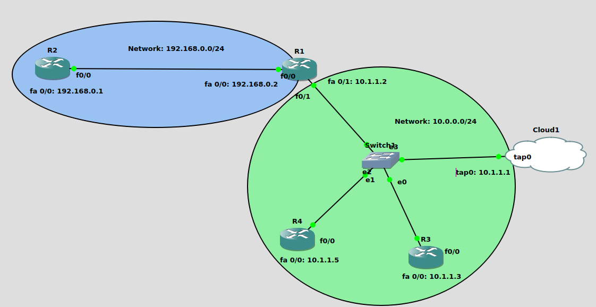

# Network Automation in GNS3

This project provides a simple web interface to interact with a GNS3 topology. Users can select a router, enter commands, and execute them directly on the selected router using SSH. The results of the command execution are displayed in the web interface.

## Project Features

1. **GNS3 Topology**: 
   - The topology consists of 4 routers, configured to allow SSH access through a tap interface.
   - Routers are interconnected as shown in the topology diagram.
   
2. **Web Application**:
   - Built using Flask and provides a user-friendly interface for router interaction.
   - Allows users to:
     - Choose a router from the dropdown menu.
     - Enter any command for execution.
     - View the command output in the web browser.

3. **Automation**:
   - Commands are executed on routers using SSH (Netmiko or Paramiko).
   - Output is retrieved and displayed dynamically.

## File Structure

- **app.py**: Main Flask application that powers the web interface.
- **templates/index.html**: Home page where users can select a router and enter commands.
- **templates/result.html**: Page that displays the command output.
- **static/**: Contains any static files (e.g., CSS, JavaScript, images).

## Topology Diagram

The following diagram illustrates the network setup:



- **Network Segments**:
  - 192.168.0.0/24: Network connecting R1 and R2.
  - 10.0.0.0/24: Network connecting R1, R3, R4, and Cloud1 via Switch1.

## Requirements

### Hardware/Software
- GNS3 installed and running.
- Tap interface configured for connecting the GNS3 environment to the local machine.
- Python 3.x installed.

### Python Libraries
Install the required dependencies using pip:

```bash
pip install --no-cache-dir -r requirements.txt
